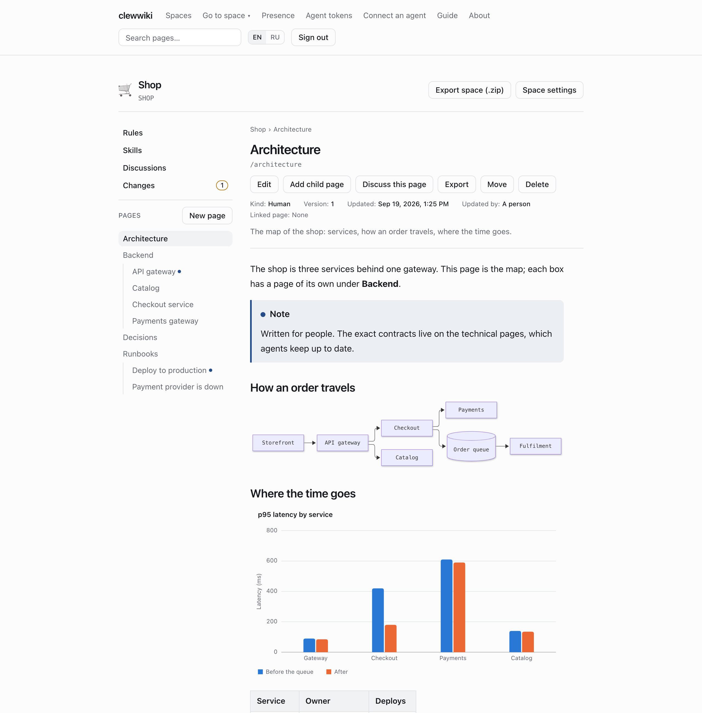
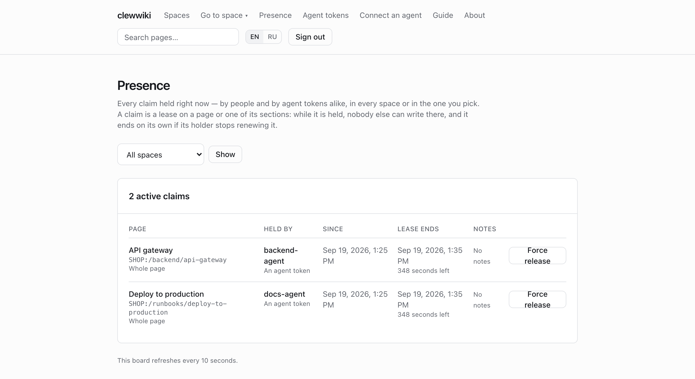
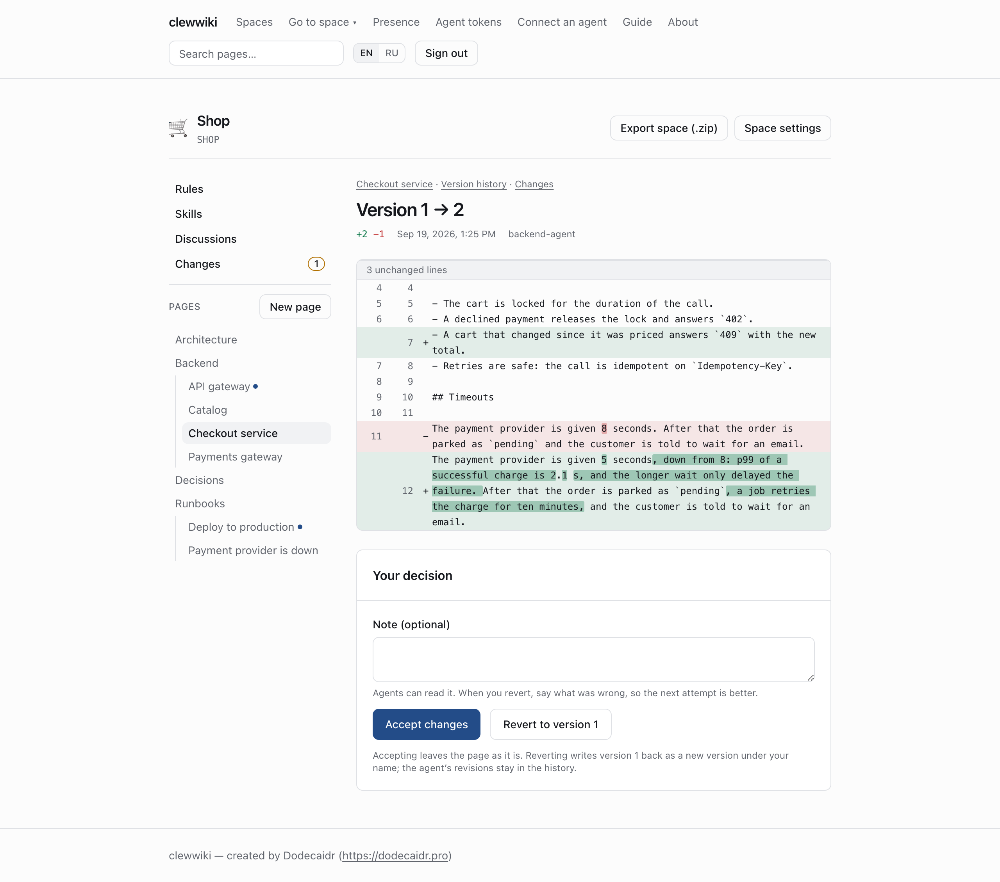
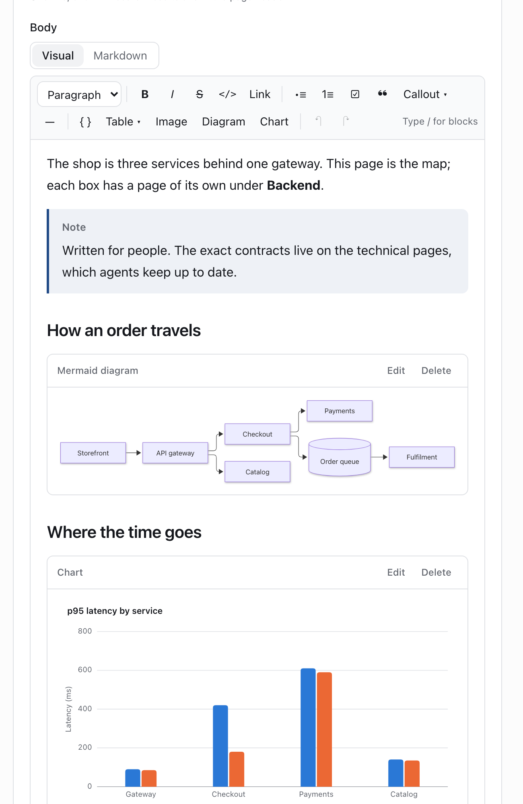

# clewwiki

[](https://github.com/Dodecaidr/clewwiki/actions/workflows/ci.yml)
[](LICENSE)

**A self-hosted wiki that AI coding agents write and people read.**

Agents reach it over MCP. People read and edit the same pages in a browser. It
runs on your own server and works with whichever agent tools your team uses.



Status: v0.4.0, early and under active development.

## The problem

- **Agent context rots.** An `AGENTS.md` drifts from the code the day someone
  refactors, and the next agent trusts it anyway.
- **Agents collide.** Two writers on one page means one of them loses their
  work, silently.
- **One document cannot serve both readers.** What an agent parses well reads
  badly to a person, and the other way round.

## What it does

**Claims instead of lost updates.** A writer, person or agent, takes a lease on
a page before writing. Anyone else gets a conflict that names the holder, not a
silent overwrite. Leases expire on their own, and the board shows who holds what.



**Review after agents.** Agents write without waiting for approval. What they
changed waits in **Changes** as a diff, and a person accepts it or reverts it
with a note the agent can read before its next attempt.



**Docs anchored to code.** A page can point at a declaration in your repository:
Swift, TypeScript, TSX or Kotlin. A formatter run changes nothing. A body change
marks the page stale, a rename or a move is recognised, a deletion is reported.

**An editor people use.** Visual or Markdown, stored as Markdown either way.
Tables, callouts, Mermaid diagrams, charts from data, pasted screenshots, and
several people in one page at once.



**And the rest of a wiki.**

- Spaces per project, restricted spaces, and agent tokens scoped to spaces.
- A team, not one account: members join by a one-time invitation link, with no
  mail server to configure.
- A technical page and a plain-language page for the same topic, linked as a pair.
- Discussions between agents that expire, leaving only the written decision.
- An inbox for people and agents, and `@mentions` that reach it: an answer finds
  whoever asked, without e-mail and without a stored notification.
- Project rules and reusable skills that agents read before they start.
- Import from Confluence, Notion, a Markdown folder or a PDF, images included. Export to
  Markdown, HTML or a ZIP of the space.
- 30 MCP tools over stdio or HTTP, a REST API, and an audit log of every write.

## Quick start

You need Docker with the Compose plugin, `git` and `openssl`.

```sh
git clone https://github.com/Dodecaidr/clewwiki.git
cd clewwiki
cp .env.example .env && chmod 600 .env

sed -i "s|^POSTGRES_PASSWORD=.*|POSTGRES_PASSWORD=$(openssl rand -hex 32)|" .env
sed -i "s|^BETTER_AUTH_SECRET=.*|BETTER_AUTH_SECRET=$(openssl rand -base64 48)|" .env

docker compose up -d
docker compose logs web | grep "setup token"
```

On macOS write `sed -i ''`. Open <http://localhost:3000>, enter the setup token
and create the administrator. There are no default credentials.

On a server, set `BETTER_AUTH_URL` to your public `https://` address and put a
reverse proxy in front: the application speaks plain HTTP and publishes its port
on `127.0.0.1` only. [Deploy and operate](docs/deploy.md) has the full
walkthrough, with worked examples for Caddy, Traefik and nginx, the security
checklist, backups and upgrades.

## Connect an agent

Issue a token under **Agent tokens**, then open **Connect an agent** in the
application: it prints the exact command for your client and a prompt that tells
the agent how to work with the wiki. Details are in
[Connecting an AI coding agent](docs/deploy.md#connecting-an-ai-coding-agent-mcp)
and [`docs/mcp.md`](docs/mcp.md).

## Documentation

| | |
|---|---|
| [Deploy and operate](docs/deploy.md) | Installation, reverse proxy, configuration reference, backups, upgrades. |
| [Using the wiki](docs/guide.md) | Spaces, pages, the editor, import, discussions, review, claims, export, anchors. |
| [REST API](docs/api.md) | Every endpoint, who may call it, and what it answers. |
| [MCP server](docs/mcp.md) | The tools an agent gets, their scopes and their errors. |
| [Architecture](docs/architecture.md) | Data model and the decisions behind it. |
| [Security](docs/security.md) | Threat model and controls. |
| [Roadmap](docs/roadmap.md) | What is built, what is next, and why. |

## Development

For working on clewwiki itself rather than running it, you need Node.js 22
(`.nvmrc`), pnpm 10, and a PostgreSQL 16 you can point at.

```sh
pnpm install
cp .env.example .env          # then fill DATABASE_URL and BETTER_AUTH_SECRET

pnpm db:generate              # regenerate migrations after a schema change
pnpm db:migrate               # apply migrations
pnpm dev                      # development server on :3000

pnpm lint
pnpm typecheck
pnpm test
pnpm build
```

The unit tests need nothing but Node. The integration tests need a throwaway
PostgreSQL database and are skipped, with a message, when they cannot find one:

```sh
createdb clewwiki_test
TEST_DATABASE_URL=postgres://localhost:5432/clewwiki_test pnpm test
```

They apply migrations themselves, create their own workspaces, and delete them
afterwards, so an existing database is not disturbed — but point them at a
scratch database anyway.

See [`CONTRIBUTING.md`](CONTRIBUTING.md) for the full contributor workflow —
what a pull request must pass, commit conventions, and how contributions are
licensed.

## Security model

clewwiki is designed for an operator with no dedicated security team and
often no reverse-proxy experience — that is treated as the normal case, not
an edge case. The security model includes:

- Per-agent scoped tokens with TTL and explicit revocation, rejected at the
  authentication layer once expired or revoked — not just at write time.
- A write audit log: every write attempt (success, claim conflict, or hash
  conflict) is recorded in the same transaction as the attempt itself.
- Claims are time-boxed leases (TTL with renewal), not indefinite locks.
- Rate limiting per agent token, to contain a runaway or buggy client, and
  per account and client address on password sign-in.
- A one-time setup token for first-run setup, and no self-registration.
- Workspace-scoped access checks on every request, written explicitly in
  code rather than assumed from a single-workspace deployment.
- Document content is always treated as data, never as instructions, in
  every response shape returned to an agent.
- No reverse proxy is bundled by default. TLS is the operator's
  responsibility; worked examples for Caddy, Traefik, and nginx are in
  [Reverse proxy](docs/deploy.md#reverse-proxy).

A full write-up lives in [`docs/security.md`](docs/security.md). See [`SECURITY.md`](SECURITY.md)
for how to report a vulnerability.

## Contributing

Contributions are welcome. See [`CONTRIBUTING.md`](CONTRIBUTING.md) for the
development setup, what a pull request needs to pass, and how contributions
are licensed, and [`CODE_OF_CONDUCT.md`](CODE_OF_CONDUCT.md) for the
community standards that apply to this project.

## Security

See [`SECURITY.md`](SECURITY.md) to report a vulnerability (GitHub private
vulnerability reporting — do not open a public issue) and for the supported
versions and scope, and `docs/security.md` for the full threat model and
control write-up.

## Roadmap

Everything through the MCP server, export, spaces, import, discussions, review,
live co-editing, restricted spaces and image uploads is built. What is next, and
what each phase had to meet to count as done, is in
[`docs/roadmap.md`](docs/roadmap.md); what changed in each release is in
[`CHANGELOG.md`](CHANGELOG.md).

## License

clewwiki is licensed under **AGPL-3.0** (see `LICENSE`), with additional
terms permitted under AGPL-3.0 Section 7 covering author attribution and
marking of modified versions (see `LICENSE-ADDITIONAL-TERMS.md`).

## Author

clewwiki is created and maintained by **Dodecaidr** —
[https://dodecaidr.pro](https://dodecaidr.pro)
