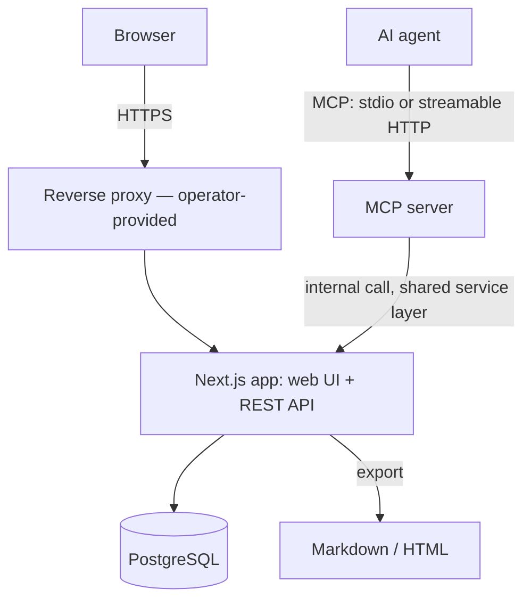
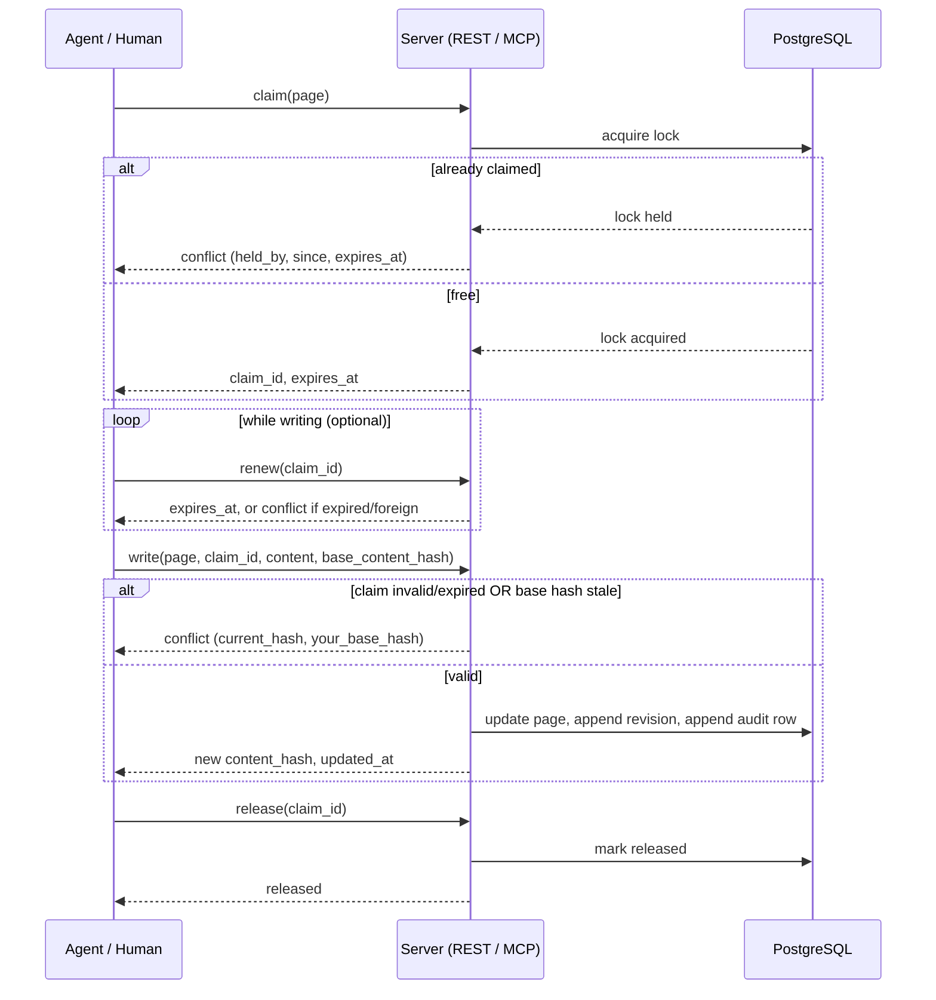

# Architecture

## Components

Web UI and the MCP server are both thin clients of one REST/service layer
running inside the same Next.js process. There is no separate backend
service and no message queue — claims and writes go through the same code
path regardless of whether the caller is a browser client or an agent
token, so the conflict-safe write guarantee applies uniformly to both.



clewwiki is a server product, not an offline-first client: agents and
browsers always talk to a live instance, and there is no local cache or
sync/reconciliation layer to design for.

## Claim → write → release

The conflict-safe write protocol is the core mechanism the rest of the
product is built around. A claim is a time-boxed lease on a page, or on a
named section within a page, implemented as a database-level lock rather
than an application-level heuristic.



Unrenewed claims expire on the server: lazily, on the next claim attempt
against the same target, and via a periodic sweep. Granularity defaults to
the whole page; a caller may instead claim a named section, so one writer
can hold a section while another edits a different section of the same
page concurrently.

Three decisions make that picture hold up under concurrency.

- **The lock is taken on the page row, not on the claims table.** A
  page-level claim and a section claim on the same page exclude each
  other, and no unique index can express a comparison between "this whole
  page" and "one section of it". Both callers meet on the page row
  instead: the transaction that decides whether a target is free and the
  insert that takes it run under one `select … for update` on it, so the
  second caller reads the first one's committed claim rather than an empty
  table. Two partial unique indexes — at most one active claim per page
  when no section is named, at most one per (page, section) otherwise —
  sit underneath as the net, and a violation of either is answered as a
  conflict rather than as a server error.
- **Expiry is a release, not a filter.** A lease past its deadline is
  written back as released with reason `expired`, both by whichever
  transaction next needs the answer and by a background sweep for the ones
  nobody asks about. If expiry were only a `where expires_at > now()`
  predicate, the unique indexes would still be occupied by leases the
  service considers dead, and the page would stay unclaimable until the
  sweep caught up.
- **A refused attempt is audited outside the transaction it describes.**
  Successful writes commit their audit row with the write. A refusal
  cannot: the transaction carrying it is the one being rolled back. So the
  rejection is recorded immediately afterwards on its own connection,
  which is as close to "same transaction" as a refused attempt allows.

Notes hang on a claim rather than on a page. They carry the claim's
deadline, they are deleted when it ends — by release, by expiry or by an
administrator — and they never reach `page_revisions`: a note is intent
while an edit is in flight, not a version of the document.

One limitation is worth stating plainly while it lasts. A section claim is
enforced as exclusion — it keeps a page-level claim and a competing claim
on the same section out — but the write it authorises is still a write of
the whole page body, because the server has no section boundaries to check
a body against. Two holders of different sections writing at the same time
are therefore separated by the content hash rather than by the section: the
second write is refused as `stale_base` and the caller re-reads and merges.
Nothing is lost, and the check that closes the gap is additive.

Anchors do not close it. An anchor's `section_id` names the part of the page
a piece of code belongs to, which is enough to flag the right section and not
enough to police a write: it says which section an anchor is about, not where
that section starts and ends in the Markdown. Deriving boundaries from the
document's own headings is the additive check, and it is not in this phase.

A claim that outlives the client holding it can be force-released by a
workspace administrator. That is a human role check, not a scope: an agent
token carries scopes but no role, so it cannot take a claim away from
anyone however broadly it is scoped.

## Content model

A page body is Markdown and nothing else: CommonMark with GitHub's extensions
(tables, task lists, strikethrough, autolinks) and GitHub's alert syntax for
callouts. There is no second stored representation — no editor JSON, no HTML —
because the stored text is what agents read and write, what search indexes, and
what the exports carry. Anything a person can put on a page an agent can write
as plain text, and the other way round.

Three constructs carry more than prose:

- **Callouts** are blockquotes whose first line is `[!NOTE]`, `[!TIP]`,
  `[!IMPORTANT]`, `[!WARNING]` or `[!CAUTION]`. They need no validation: a
  marker that is not one of these is an ordinary quote.
- **Diagrams** are ```` ```mermaid ```` fences, drawn in the reader's browser.
- **Charts** are ```` ```chart ```` fences holding one JSON object — a chart
  type, labels, series of numbers, an optional unit and value axis — drawn as
  SVG on the server.

### One package for the rules

`packages/content` (`@clewwiki/content`) holds the chart block's zod schema and
limits, the chart renderer, the Mermaid keyword list and templates, the callout
kinds, the block finder that validation uses, and the format guide built from
all of them. The web application imports it on the server (validation,
rendering, export, the guide endpoint) and in the browser (the editor's chart
form, previews and live validation). A package rather than a folder in
`apps/web`, so the rules have no dependency on Next.js and are tested on their
own; not part of `packages/mcp-server`, because that package is published to
npm on its own and would then carry a copy of the rules that can fall behind the
instance an agent is talking to. The MCP tool `wiki.format_guide` fetches the
guide from the instance instead.

### Rendering

One pipeline serves the page view, the editor's Markdown preview and the HTML
export: `remark-parse` with GFM, `remark-rehype` (raw HTML in a body is
dropped), then chart fences are replaced by the renderer's SVG, then
`rehype-sanitize`, then Mermaid fences become `<pre class="mermaid">` and alert
blockquotes become `div.callout`, then serialisation. The chart rewrite runs
*before* the sanitiser on purpose, so the SVG is held to an allowlist — exactly
the elements and attributes the renderer can emit, listed by the renderer
itself — rather than trusted. The Mermaid and callout rewrites run after it, as
the Mermaid one always has: their classes are added by the pipeline, not taken
from the document.

`renderChartSvg(spec, theme)` is pure layout arithmetic with no DOM and no
runtime library: axes with 1-2-5 ticks, grouped and stacked bars with a rounded
data end, lines and areas, scatter points, pie and donut arcs, a legend when
there is more than one series, and a `<title>` and `<desc>` that spell the data
out for screen readers. Series colours come from a fixed, ordered palette of
eight whose neighbours stay distinguishable for colour-blind readers, which is
why a chart takes at most eight series. Every mark carries a class that the
stylesheet maps onto light and dark tokens, and a plain colour attribute as the
fallback for an SVG opened on its own. The export embeds the same SVG, so charts
show and print from a file opened offline with scripting off; Mermaid diagrams
stay source text there, because drawing them needs Mermaid in a browser.

### Validation on write

`createPage` and `updatePage` in the page service validate every chart block
against the schema and check every Mermaid block structurally — the first
diagram line must start with a known keyword — before the body is stored. Both
REST and the page form reach the service, so an agent and a person get the same
refusal: `validation`, with the first invalid block's `block_index`, `line`,
`language` and `errors` (`path` and `message`), plus all invalid blocks under
`blocks`. Mermaid is never executed on the server: a check that needs a headless
browser per write is not a check worth its cost. An update is checked only when
its body changes, so a page stored before the rules existed can still be renamed
or moved.

### The visual editor

The web editor has a Visual tab and a Markdown tab over the same Markdown
string. The requirement that decided its construction is that opening a page
written by an agent and saving it without an edit must not rewrite a byte of
it: an editor that normalises bullets, emphasis markers and table padding would
make every human visit a diff in the page's history and a reformatting of the
agent's text.

The candidates were measured rather than compared on paper. A corpus of
thirteen agent-style pages (nested lists, task lists, tables with and without
alignment and padding, GitHub alerts, Mermaid and chart fences, code with info
strings, HTML-looking text, `_`/`*` emphasis, hard breaks, reference links, no
trailing newline) was loaded and serialised by each without edits:

| Approach | Byte-identical | Content lost |
|---|---|---|
| TipTap 3.31 with `@tiptap/markdown` | 1 of 13 | HTML-looking text, a raw `<script>` line, an image, reference link definitions |
| Milkdown 7.22 (`commonmark` + `gfm` presets) | 4 of 13 | code block info strings (`title="…"`), reference link definitions |
| `remark-stringify` alone, tuned settings | 6 of 13 | none |
| TipTap 3 editing surface + remark bridge with block source preservation (chosen) | 13 of 13, and 22 of 22 in the test corpus | none |

Neither packaged serializer is faithful enough, and both lose content in
ordinary agent pages. Milkdown is the closer of the two because it is built on
remark, but its presets rewrite the tree on the way in (reference links are
inlined, info strings dropped), and working around that means replacing most of
its Markdown layer anyway. So the editor uses TipTap 3 for what it is best at —
the editing surface: schema, commands, tables, task lists, the suggestion plugin
behind the "/" menu, React node views — and does its own Markdown conversion
(`components/editor/markdown-bridge.ts`) with the same remark parser the renderer
and the validator use, so the editor cannot see a different document than a
reader does:

- every top-level block remembers the exact slice of source it came from and
  the whitespace before it;
- on save, a block whose editor node is unchanged is written back as that slice;
  only edited, inserted or moved blocks are serialised, with `remark-stringify`
  using the bullet, emphasis, rule and fence characters the page already uses
  and a `| --- |` delimiter row;
- constructs with no visual form (raw HTML blocks, reference and footnote
  definitions, lists that mix task and plain items) are kept as verbatim source
  blocks, and inline HTML or references as verbatim inline nodes;
- on open, the editor binds its own normalised document to the source blocks
  and checks that saving would return the input unchanged; if it would not, the
  page opens on the Markdown tab with a notice instead of being reformatted.

The known limits are the ones an edit brings: an edited block comes back in
canonical form — a setext heading as `#`, an indented code block fenced, a hard
break as a backslash, a table's column padding dropped — while every block
around it stays as it was. A table cell holds one line, so cells pasted with
several paragraphs are joined, and merged cells are not representable in
Markdown. The editor offers no font, size or colour, because none of them
survives being stored as Markdown.

HTML pasted from a word processor, Google Docs or Confluence is parsed by the
editor's schema, which keeps headings, lists, tables, links and emphasis and has
nowhere to put fonts or colours; Markdown pasted as plain text is parsed as
Markdown.

## Anchor model

An anchor ties a page section to a declaration in a source repository:

```
{ page_id, section_id, kind, qualified_name, file_hint, token_hash,
  line_range?, state, last_checked_at }
```

Design decisions, validated on a real refactoring history (26 commits,
479 anchors; symbol anchors produced 0 false positives where naive
line-range anchors produced ~50%):

- **Identity is the declaration, not the location.** An anchor is
  `{kind, qualified_name}`; `file_hint` speeds up resolution but a
  declaration moved to another file is still found by a repository-wide
  search for the same identity.
- **The hash covers the AST token sequence, not text.** Normalising
  whitespace and comments is not enough: a formatter run flips more than
  half of text-based hashes while changing nothing semantically. Hashing
  the parser's token stream keeps formatting-only commits quiet.
- **Three resolution states instead of one flag.** `stale` (same
  declaration, body changed), `moved-renamed` (declaration recovered
  under a new name or container via body match), `lost` (nothing
  resolvable). Each state is shown to the reader differently; nothing is
  rewritten automatically — a human or agent reviews and clears it.
- **Line ranges are a fallback only.** Blocks with no resolvable
  declaration (configuration, prose) keep a `line_range` plus hash; the
  share of line-range anchors per repository is logged as an early signal
  of eroding trust.
- **Parsers via tree-sitter, compiled to WebAssembly.** Swift,
  TypeScript/TSX and Kotlin ship. Adding a language means
  adding its declaration node-type table and a grammar file, not touching
  the pipeline. The grammars are WebAssembly rather than native bindings
  so that the runtime image stays a plain `node:22-slim` with no compiler
  toolchain in it — a native grammar would mean `node-gyp` in the image
  and a rebuild on every Node upgrade, for a parser that is read-only.
- **The repository is read, never run.** Each space links its own
  repository — one project, one code base. The server keeps a bare mirror
  per space, fetches it under a per-space lock, and reads blobs with
  `git show`. There is no working tree, so nothing from a repository
  is ever laid out on disk in a form something could execute, and no
  build, install script or hook runs at any point. Repository content is
  data — the same rule page bodies are held to. The credential for a
  private repository is named by environment variable in the space's
  settings rather than stored in them, so it never reaches the database,
  a backup, or an API response. The name must be `CLEWWIKI_GIT_TOKEN` or
  `CLEWWIKI_GIT_TOKEN_<NAME>`, so the setting cannot reach any other
  secret of the process, and the credential is sent only to the
  repository's `https://` origin.
- **Rename recovery matches on the body, not the declaration.** The
  declaration's token hash covers its name, so a rename changes it by
  construction; what survives a rename is the hash of the body's tokens,
  and that is what the recovery stages compare. Bodies below a few tokens
  are not compared at all, because `{ return nil }` is not evidence.

The same staleness mechanism drives the linked technical/human document
pair: instead of targeting a code hash, it targets the paired document's
content hash, so editing one side of the pair flags the other as
potentially out of sync.

## Data model

The schema is organized around these entities (full column-level detail
lives in the implementation, not here):

- `workspaces`
- `users`
- `agent_tokens`
- `spaces`
- `space_members`
- `pages`
- `page_revisions`
- `page_reviews`
- `page_comments`
- `page_collab_states`
- `claims`
- `claim_notes`
- `anchors`
- `skills`
- `discussions`
- `discussion_messages`
- `agent_write_audit`

`page_revisions` is an append-only version history; ephemeral notes are
explicitly excluded from it and expire with the claim they are bound to.
They are called `claim_notes` rather than `agent_notes` because what binds
them is the claim, and people leave them as well as agents. The write
audit is written in the same transaction as the write attempt it records
wherever that transaction commits, so it serves as a forensic log rather
than best-effort telemetry; the one case it cannot join is a refused
attempt, whose transaction rolls back, and there the row follows
immediately on its own connection.

Per-workspace policy that is neither structure nor a foreign key — the
default claim TTL, today — lives in a `settings` JSON column on
`workspaces`. It is read with the workspace row, queried on its own by
nothing, and a new knob must not be a migration. A value that ever needs
an index or a reference graduates to a column of its own.

### Spaces

A workspace is divided into **spaces**, one per project or product area, the
way Confluence divides a site. A space row carries a `key` (2–10 uppercase
letters or digits, unique per workspace, enforced by a CHECK constraint and a
unique index, and never updated), a name, a short Markdown description, an
icon, an optional `home_page_id`, its creator and timestamps, `archived_at`,
and its own `settings` JSON — which is where the source repository link lives
now. The repository used to be a workspace setting; it moved to the space
because each project has its own code, and a space is the unit that owns a
page tree.

Every page belongs to exactly one space (`pages.space_id`, not null), and
everything that works on the tree stays inside it. The partial unique index on
live paths is on `(space_id, path)`, so `/backend` can exist once per space. A
move, a subtree delete and a restore match descendants by path prefix *within
the page's space*; a parent must be in the same space; a technical/human pair
is always within one space. Claims, notes, anchors and revisions hang on page
ids and needed no change: the space of any of them is the space of its page.

A page changes space in one way only, `movePageToSpace`, and it takes its whole
subtree along in one statement, so those invariants hold before and after and
never in between. It is modelled on the subtree delete, not on a write: it
takes no claim, writes no revision — nothing about the content changed — and is
refused under anybody else's live claim, with no administrator override,
because a move under a writer would answer them `404` in the middle of an
edit. Two tables copy their page's space for the sake of per-space listings,
`page_comments.space_id` and `page_reviews.space_id`, and visibility is decided
on that copy, so the move rewrites both in the same transaction. A pair the
move would split is broken on both sides; a page the source space designates
(home, rules, parent of decisions) refuses the move rather than leaving a
project without its rules; both space rows are locked, in id order, so neither
a designation nor an archive can slip in between the check and the update.
Soft-deleted descendants are left behind, as they are by a move inside a space,
and a restore refuses them once their parent is in another space.

Space membership is not a table. Roles stay workspace-wide in this version —
an editor can edit in every space — and the only per-space access control is
on agent tokens: `agent_tokens.space_ids` is a JSON list of space ids, or
`null` for every space. The handlers check it next to the workspace check,
explicitly, on every endpoint that reaches a page, a claim, an anchor, a
search, presence or an export, and answer `404` for anything outside the list.
Lists and searches use the list as their filter rather than filtering
afterwards.

Archiving is a timestamp, not a deletion: an archived space keeps its pages
readable, leaves the space list and "all spaces" search, and refuses new pages
and new skills.

### Restricted spaces, and why a person's visibility is an allowlist

A restricted space has to not exist for somebody who is not in it — on every
endpoint, every page and every server action, present and future. The design
question is where that is enforced so that it does not depend on remembering.

**REST already had the place.** A token limited to some spaces carries an
allowlist, `spaceIds`, and every handler checks the space of the resource it is
about to touch against it (`requireSpace`, `resolveSpaceParam`, `visibleSpaces`),
answering `404` on a miss. So a person's visibility is computed into that same
shape when they are authenticated (`visibleSpaceIdsForUser`): `null` when nothing
is hidden from them — the common case, one query — and the list of spaces they
can see otherwise. No handler was changed; the identity was. Twenty-seven ways
into a restricted space are tested to answer `404` to a non-member.

**The interface did not, so it was given one.** Pages and server actions use the
session, not that identity, and call services that scope by workspace and know
nothing of who is asking. They now look things up through `lib/spaces/visibility`
(`findSpaceByKey`, `findSpaceById`, `findPage`, `findSpaces`) and
`lib/spaces/guards` (`canViewPage`, `canViewClaim`, `findDiscussion`, …) with the
session as the viewer; a hidden space comes back `null`, which every caller
already treats as "not found". Because that is a convention, it is tested as
one: `tests/space-visibility-guard.test.ts` fails when interface code calls an
unguarded lookup, when a listing that spans spaces is not scoped to the
session's, and when an action that takes an id does not check it.

**Metadata is a page too.** `generateMetadata` runs beside the page and its
result is streamed to the browser even when the page goes on to answer "not
found". A discussion's title reached a non-member that way until a sweep of the
running application, as a non-member, against every URL of a restricted space
found it. By-id loaders are guarded like lookups for that reason.

**A stream is authorised once.** A live editing session's server-sent events
were authorised when the stream opened. When who may see a space changes, its
rooms are closed — unsaved text persisted first — and browsers reconnect and are
authorised again.

**Visibility, not roles.** Read-only membership would have to be enforced on
every write path, one by one, and proving that none was missed is a different
and larger problem than proving a lookup is guarded. Visibility covers the case
people ask for first — a space the rest of the company should not see — and
leaves roles as an addition rather than a rewrite.

### Rules of a space, and its skills

Two things a space carries besides its pages, and they are stored differently
because they are different kinds of thing.

**The rules of a project are a page.** A space has a nullable `rules_page_id`
pointing at one of its own pages, and `GET /api/v1/spaces/{key}/rules` returns
that page's identity and body. Storing the rules as Markdown in a column of
`spaces` would have been fewer moving parts and worse in every way that matters:
rules are edited more often than anything else in a young project, and a page
brings the revision history, the diff between versions, the claim protocol that
stops two people rewriting them at once, the editor people already know, search,
and export — all of it already built. The column says *which* page, nothing more;
a deleted page clears it through the foreign key, and a page designated in
another space is refused when it is set. The cost is one indirection on read,
which is a join the rules endpoint makes once.

**Skills are their own table.** A skill is not a page: it has no path, no parent,
no technical/human counterpart, nothing to claim, and it is addressed by a slug
that has to be a legal directory name on somebody else's laptop, because that is
where it ends up. `skills` carries `space_id`, `slug` (unique per space among
live rows, the way a page path is), `name`, `description`, `body`, `version`,
`tags`, authorship on both ends and a soft-delete timestamp.

The `SKILL.md` convention is front matter plus a Markdown body, and the choice
worth recording is that **the stored body holds no front matter**. `name`,
`description`, `version` and `tags` are columns, and the file is reassembled
from them whenever one is produced — by the REST resource's `skill_md`, by the
web UI's copy button, by the install command. The alternative, storing the file
whole, would mean parsing YAML to render a list of thirty skills, would let the
front matter and any indexed copy of it drift apart, and would make "rename this
skill" a text edit inside a blob. A writer may still *send* a whole `SKILL.md`:
`packages/content/src/skill.ts` takes the front matter off, fills in whatever the
request did not pass, and refuses front matter that does not parse with a
`validation` error naming the field and the line — the same treatment, and the
same details shape, an invalid chart block gets. The YAML accepted is
deliberately a fragment: a flat mapping of the four known keys. Anything richer
is refused rather than half-understood.

Bodies are bounded at 256 KB, checked in octets rather than characters by a
CHECK constraint as well as in the service, because the limit exists to bound
what a response and a written file carry and a body of Cyrillic is twice its
character count.

The install path lives in `packages/mcp-server` rather than anywhere else
because agent hosts read skills from directories on disk, which no MCP tool call
can write to — the package people already run as their server is the one place
that is both installed on the right machine and allowed to touch the file
system. It is a REST client like the rest of that package: it holds a token and
has no other way in.

### Discussions, and why the chat is ephemeral

Agents working on the same project in parallel run into each other. One is
about to change a contract another depends on; one has an assumption it cannot
check alone. "I am changing the auth contract, does anything of yours depend on
it?" is a question that has to be asked somewhere, and there was nowhere in
clewwiki to ask it: a page is a statement about how things are, a claim note is
one line that dies with a lease, and neither is a conversation.

The decision this feature encodes is that **the conversation is ephemeral and
its outcome is not.** A discussion lives in a space, holds messages of at most
8 KB each, and optionally names the page it is about. An open thread nobody
writes in for `discussion_idle_days` (14 by default) is closed automatically. A
resolved thread is deleted, with every message in it, `discussion_retention_days`
(7) after it was resolved. What survives is a **decision page** — an ordinary
page of the space, created when the thread is resolved.

The alternative — keep every thread forever, the way an issue tracker does —
was rejected because of what a wiki is for. The value of this wiki is that an
agent can read it and act on it without asking anybody. A space carrying two
hundred half-finished "does anything of yours use this?" threads from last
quarter costs every reader, human and agent, the work of deciding which of them
was ever settled, and the ones that were settled are exactly the ones whose
conclusions belong in a page anyway. Keeping the chat would have grown the
corpus that agents search over with text that is, by construction, superseded.
So the retention is not a storage optimisation; it is the thing that keeps the
feature from making the product worse.

**One deadline, not two.** `discussions.expires_at` is `not null` and means
"when this thread is next acted on": the idle deadline while it is open, the
deletion date once it is resolved. The sweep is one indexed scan, the interface
can always say when a thread goes away, and no reader has to work out which of
two nullable dates applies. It is recomputed on every message, which is what
makes an active conversation stay.

The sweep itself follows the claims sweep exactly — a timer in
`instrumentation.ts`, unref'd, failures logged rather than thrown, disabled with
`DISCUSSION_SWEEP_INTERVAL_SECONDS=0` — with a longer interval (five minutes)
because the deadlines are measured in days and anything tighter is polling.
Expiry is also applied lazily wherever the answer matters: listing a space's
discussions, reading a thread, and counting the open ones against the cap. As
with claims, the sweep therefore changes no decision; it acts on the threads
nobody asked about and leaves the audit rows saying when each one lapsed.

A thread closed for inactivity is not marked with a stored sentence. It is
resolved, `resolved_by = 'system'`, with no decision page — which is precisely
what "nobody wrote down an outcome" is — and the interface derives the note it
shows from that. A stored "closed for inactivity" would have been one language's
wording shown to everybody regardless of what they read in.

**The decision page is a page, and nothing else.** Resolving requires a
decision text; the service assembles an ADR-shaped body — context, options
considered, decision, consequences, then a footer naming the participants and
the dates the thread ran between — and calls `createPage` with it, under the
space's `decisions_page_id` (or `/decisions`, created on first use). No new
storage, no second renderer, no export path of its own: it is versioned,
searchable, exportable, linkable and editable under a claim from the moment it
exists, because it is the same thing as every other page. `discussions`
references `pages` and never the reverse, so deleting a thread — by sweep, by
an administrator, by its opener — cannot touch the page it produced.

The page carries **no link back to the thread**. The thread is going to be
deleted, so the link would certainly break; it records the thread's title and
its dates instead.

**The server does not summarise anything.** `context`, `options` and
`consequences` are the caller's prose — a person typing into the resolve form,
or an agent that has read the thread and is reporting what it concluded. The
temptation to have the server read the messages and write the decision was the
one real design risk here: a decision page invented out of a conversation the
writer did not take part in is a plausible, wrong record, and the next agent to
read it will believe it. `buildDecisionPageBody` is therefore a pure function
that puts four blocks under four headings, and it is unit-tested as such.

The retention knobs live in `spaces.settings` for the reason every other knob
does: read with the row, queried on their own by nothing, and a new one must not
be a migration.

### Live editing sessions, and why a room holds one claim

People wanted to be in a page together. The product is built on the opposite
idea — one writer at a time, enforced by a claim — and it is built on it for the
sake of agents, which cannot merge and must never lose a write. The design keeps
both: **a room is one writer.**

**One claim, held by the room.** A room is a page's shared document, the
browsers connected to it, and a single claim under the identity
`collab:<pageId>`, labelled with the names of the people present. Inside the
room a CRDT merges edits, so people do not contend with each other; outside it
the room is a claim holder like any other, so `wiki.claim` answers `CONFLICT`
naming it and the agent protocol is unchanged to the byte. The holder is not a
person, so nothing changes hands when whoever opened the session leaves.
`updatePage` takes a `claimActor` for this one caller: the claim is checked
against the room, and the revision is authored by the person who saved.

**The server does not understand the document.** It relays Yjs updates and keeps
the merged state, as opaque bytes. It has no editor schema and no Markdown
bridge, and it never turns the document into a page. The browser that saves
does that, and sends Markdown through the ordinary write path together with the
state vector of the document it serialised — so that an edit which arrived a
moment later is not reported as saved. Validation, revisions, audit and review
see a write like any other.

**Byte-for-byte survives the CRDT, and that was measured first.** The Markdown
bridge keeps a table of source slices beside the document, keyed by the content
of each block rather than by node identity. Any browser can therefore rebuild
the table from the saved page alone (`bindBase`) and write the shared document
back against it: a block that still equals a block of the saved page is written
as that page's bytes, whoever is looking and whenever they joined. The corpus of
agent pages round-trips unchanged through a second browser's copy of the
document, and an edit by one browser re-serialises, on the other, exactly the
line it touched. The stock TipTap Markdown serializer keeps 1 page of 13.

**The document is built once.** A room starts empty. The server asks exactly one
browser to build the document from the page (`hello.seed`) and hands the job on
if that browser leaves; everybody else waits. Two browsers building the same
page would produce the page twice, which is the one thing a CRDT cannot undo. A
browser that reconnects to an empty room after a restart offers the document it
already has instead of building a second one.

**Server-sent events, not a WebSocket.** Events arrive on an ordinary streamed
response and edits leave as ordinary `POST`s. A self-hosted instance therefore
needs no second process, no second port and nothing new from its reverse proxy;
`Cache-Control: no-transform` and `X-Accel-Buffering: no` keep the response
from being collected on the way, this server's own compression included. It was
checked against the production build before anything was built on it. Updates
are sent one request at a time and merged while one is in flight, so a refusal
stops the queue with the edits still in it.

**A forgotten tab cannot hold a page.** A room renews its claim only while
somebody has typed in the last five minutes or something is unsaved. Otherwise
it releases the claim and is `paused`; typing takes the claim back. A claim
taken afresh starts from the page as it then is, and if that is not the version
the room was editing, the room is reset — a CRDT of a text that no longer exists
has nothing to be merged into.

**Unsaved text outlives the process.** The merged state is written to
`page_collab_states`, debounced, with the content hash of the version it was
typed over, and is resumed only against that exact version. With the last person
gone and text unsaved, the claim is left to lapse by its TTL rather than
released, so whoever comes back within it finds the page still theirs.

Rooms live in the application process, as the rate limiters do. That is correct
for one process per instance; several would need the updates carried between
them, which PostgreSQL `LISTEN`/`NOTIFY` can do and which nothing needs yet.

### Review after agents, and why pending is derived

Agents write without asking. A review queue *in front of* the write would make
every agent as slow as the person approving it, and the claim protocol already
keeps writers from overwriting each other — so the review comes after. What a
person needs is a list of what changed since they last looked, and a way back.

**The baseline.** For each page, the newest version that a person wrote or
accepted. Agent revisions after it are pending. It is computed from
`page_revisions.author_type` and `page_reviews`, never stored: there is no
`needs_review` flag to fall out of step with the history, a person's edit
settles what came before it without anything being recorded, and a page an agent
created has baseline 0 and is pending from version 1. The page row already
carries the author of its newest revision (`updated_by_type`), so "is anything
pending in this space" rules most pages out before a subquery runs.

**A review covers a range.** `page_reviews` has `from_version` (the baseline,
exclusive) and `to_version` (what the reviewer saw, inclusive), because that is
how the work is read: an agent that wrote a page four times in an afternoon
produced one change. A decision carries the version the reviewer was looking at
and is refused as `stale_base` when the page has moved on, for the same reason a
write carries a content hash.

**Accept touches nothing; revert is a write.** Accepting inserts a row under a
lock on the page. Reverting writes the baseline's title, body and summary back
as a new revision by the reviewer, through `acquireClaim` → `updatePage` →
`releaseClaim` like any other write, so it loses to a live claim instead of
overriding it, and the history keeps the agent's revisions followed by the one
that undid them. The review row is inserted after that write, in its own
transaction; should it fail, the page is still consistent, because the revert is
a person's revision and therefore a baseline with or without the row.

**The diff is a library, not a dependency.** `@clewwiki/content/diff` is Myers'
O(ND) over lines, with the common head and tail set aside first and the trace
kept only for the diagonals each round can touch. Both inputs are caller-
supplied text, so the work is bounded explicitly: past 2 000 edits or 40 000
lines the middle is reported as removed-then-added and the result says
`coarse`. It returns data; the interface renders lines as escaped text and
never as Markdown, since a diff that rendered what it compares could not show
what changed in the source.

**Only a person decides.** The service functions take a reviewer, not an actor,
and the handler refuses a bearer token before calling them.

### Comments on paragraphs, and why an anchor is a fingerprint

A review note says why a change was reverted; a comment says where the problem
is. The design question is what "where" means on a page that keeps changing.

**Not a position.** A line number or a block index is wrong the moment anything
above it is edited, and the failure is silent: the comment now sits on a
different paragraph and still looks authoritative. **Not a fuzzy match either.**
Re-attaching a comment to the most similar paragraph is right most of the time
and misleading the rest, and "MD5 is not acceptable" pinned to the paragraph
that now says SHA-256 is worse than a comment that admits its text has changed.

So the anchor is a **fingerprint of the block's text**, whitespace normalised,
taken from the version the commenter was reading (`block_fingerprint`, with
`block_index` kept only to break ties between identical blocks, `quote` to show
what it was about, and `version`). `@clewwiki/content/paragraphs` splits a body
with the same parser the page view renders with — top-level nodes, lists taken
apart into items — and the anchor is resolved against the current body on every
read: found, the thread is `current` and reports its lines; not found, it is
`outdated`. Nothing is stored about the outcome, so there is nothing to
recompute when a page is written. The fingerprint is a 53-bit non-cryptographic
hash: it tells the blocks of one page apart and is not a security boundary.

**Two ways to say where.** A person clicks a paragraph of the rendered page, so
the interface sends `block_index` and the `version` it counted in. An agent
reads bodies, so it sends a `quote`; one that occurs in no paragraph or in
several is refused rather than guessed at.

**The renderer marks the blocks.** `renderMarkdown` takes the blocks' start
lines and stamps `data-block` (and `data-comments`) on the matching elements in
a rehype step that runs *after* the sanitiser — source positions survive the
pipeline, and running last means no page content can produce or forge a mark.
The body stays server-rendered HTML that the client does not own: the gutter of
comment buttons is measured and drawn beside it, and the form is a sheet at the
bottom of the window, so nothing is inserted between paragraphs and the text
being commented on cannot move.

**Comments stay; discussions do not.** A discussion is a conversation on the way
to a decision page and is deleted. A resolved comment is itself the record —
what was asked, what was answered — so it stays with the page and goes when the
page goes (`on delete cascade`).

### Staged imports

Documentation arrives from four places — a Confluence space, a Notion export, a
folder of Markdown, a PDF — and the structural decision is that **an import is
staged, never applied on arrival**. `createImport` parses the source and writes
`import_items`; the import stops at `needs_review`; `applyImport` is a separate
call a person makes afterwards. Nothing reaches `pages` in between.

The obvious alternative — parse and write in one step — was rejected because
every one of the four sources produces a guess. A Confluence page tree is real
structure and converts well; a PDF has no structure at all, only glyphs at
coordinates, and its headings and tables are inferred from font sizes and x
positions. Writing either straight into a wiki means the first time anybody
reads the guess is after five hundred pages exist, and undoing a bulk write is
much more work than reviewing one. Staging also gives the two things a
migration actually needs: a target path a person can change before it becomes a
URL, and a per-item record of everything the converter could not carry across.

That record is the second decision: **nothing is dropped silently.** Every
converter attaches typed warnings to the page they belong to — an unsupported
Confluence macro, an attachment that stays behind, a Notion toggle that lost its
fold, a PDF table the reader could not read with confidence. A macro with no
Markdown equivalent becomes a visible `> [!NOTE]` naming it, so it is legible in
the finished page as well as in the preview. A reviewer can see every place the
import had to decide something.

`packages/import` holds the whole pipeline and depends on nothing from the
application: no database, no Next.js, no filesystem. It reads bytes and produces
`ImportNode`s, which is what makes every converter testable against a fixture
and what lets the ZIP reader and the Confluence client be written against their
own limits. The application layer (`apps/web/src/lib/imports`) does the parts
that need a database: staging, preview, applying, auditing.

**Placement uses the application's own slug generator.** A second implementation
of "what segment does this title get" would drift the first time one of them
learned a transliteration rule, and an import that puts a page somewhere other
than where the form would have put it is a bug nobody notices until the links
break. So `pages/paths.ts` and `pages/slug.ts` moved into
`@clewwiki/content` — `./paths` and `./slug` — and `apps/web` now re-exports
them from the same module paths it always used. `packages/import` imports the
same functions. Placement deliberately does *not* avoid paths the space already
has: a collision is shown as a collision, with the natural path, and the
reviewer decides between leaving it out, replacing what is there and moving it.
Numbering it `-2` silently would hide the decision and produce a second copy of
a page nobody asked for.

**Links are resolved twice, from a placeholder.** A converter cannot know where
a page will land — the tree is not placed until every node is read, and a
reviewer may move one afterwards — so a link to another page of the same import
is written as `clewwiki-import:<source id>` and stored that way. The preview
resolves it to target paths, which is what the reviewer is deciding about;
applying resolves it to the addresses of the pages the run creates. That second
resolution is why `createPage` takes an optional `id`: a batch of pages that
link to each other has to know where they will be before it writes the first
body, and drawing the ids first is cheaper and more honest than writing every
page twice. A placeholder nobody claims becomes plain text with the link's own
label, and the item carries an `unresolved-link` warning.

**Applying respects claims.** An overwrite goes through the ordinary claim
protocol — take a lease, write under it, give it back — so a page somebody else
is holding refuses the lease and the item is reported as skipped with the
holder's name. An import is a bulk write, which is exactly the situation claims
exist for, and "I was importing" is not a reason to take an edit away from the
person making it. Each item is its own transaction inside `createPage`: one page
that cannot be written does not roll back the pages that already were, because
after a partial failure a reviewer is better served by a list of what landed
than by nothing at all.

Migration `0004_spaces` moved existing data in one transaction: a `MAIN` space
per workspace that had pages or a repository, every page (soft-deleted ones
included) assigned to it, uniqueness moved to `(space_id, path)`, the
repository copied onto the space and removed from the workspace — the code has
no fallback to the old location — and `space_ids` added to tokens as `null`,
so no existing token lost access.

A page belongs to one of the two document types through its `kind`
(`technical` or `human`) and points at its counterpart through a nullable
`linked_page_id` on the same row, rather than through a separate link
table. v1 pairs exactly one technical page with one human page, which a
column states precisely and a join table would only permit; the pair's
staleness flag arrives with the anchor mechanism, and adding it does not
move the pairing.

The page tree is stored twice on purpose. `parent_id` is the edge a move
rewrites; a materialised `path` (`/backend/auth`) makes "everything below
this page" a single prefix scan instead of a recursive walk. A move
updates the moved page and every descendant's path in one transaction, so
the two representations cannot drift apart.

Full-text search is a generated `tsvector` column on `pages`, weighted
title over summary over body, with a GIN index — inside the same
PostgreSQL instance as everything else, because a workspace at v1 scale
does not justify a second system to keep in sync. A search names the spaces it
covers explicitly: one space, or every unarchived space the caller can see.
