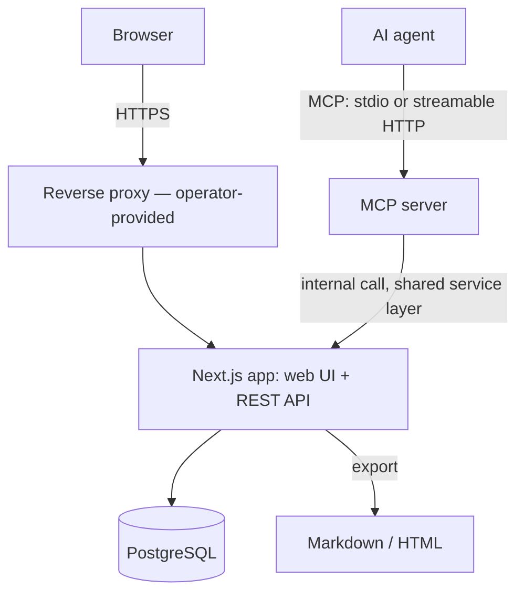
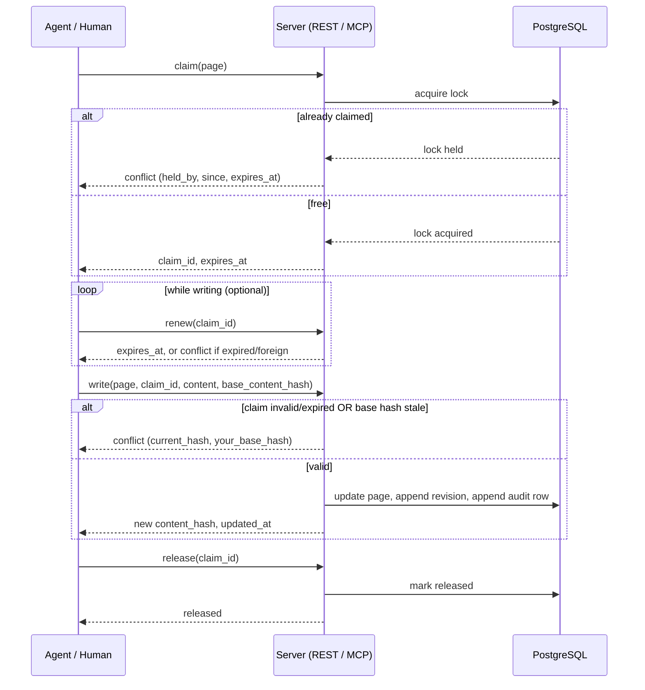

# Architecture

## Components

Web UI and the MCP server are both thin clients of one REST/service layer
running inside the same Next.js process. There is no separate backend
service and no message queue — claims and writes go through the same code
path regardless of whether the caller is a browser client or an agent
token, so the conflict-safe write guarantee applies uniformly to both.



clewwiki is a server product, not an offline-first client: agents and
browsers always talk to a live instance, and there is no local cache or
sync/reconciliation layer to design for.

## Claim → write → release

The conflict-safe write protocol is the core mechanism the rest of the
product is built around. A claim is a time-boxed lease on a page, or on a
named section within a page, implemented as a database-level lock rather
than an application-level heuristic.



Unrenewed claims expire on the server: lazily, on the next claim attempt
against the same target, and via a periodic sweep. Granularity defaults to
the whole page; a caller may instead claim a named section, so one writer
can hold a section while another edits a different section of the same
page concurrently.

Three decisions make that picture hold up under concurrency.

- **The lock is taken on the page row, not on the claims table.** A
  page-level claim and a section claim on the same page exclude each
  other, and no unique index can express a comparison between "this whole
  page" and "one section of it". Both callers meet on the page row
  instead: the transaction that decides whether a target is free and the
  insert that takes it run under one `select … for update` on it, so the
  second caller reads the first one's committed claim rather than an empty
  table. Two partial unique indexes — at most one active claim per page
  when no section is named, at most one per (page, section) otherwise —
  sit underneath as the net, and a violation of either is answered as a
  conflict rather than as a server error.
- **Expiry is a release, not a filter.** A lease past its deadline is
  written back as released with reason `expired`, both by whichever
  transaction next needs the answer and by a background sweep for the ones
  nobody asks about. If expiry were only a `where expires_at > now()`
  predicate, the unique indexes would still be occupied by leases the
  service considers dead, and the page would stay unclaimable until the
  sweep caught up.
- **A refused attempt is audited outside the transaction it describes.**
  Successful writes commit their audit row with the write. A refusal
  cannot: the transaction carrying it is the one being rolled back. So the
  rejection is recorded immediately afterwards on its own connection,
  which is as close to "same transaction" as a refused attempt allows.

Notes hang on a claim rather than on a page. They carry the claim's
deadline, they are deleted when it ends — by release, by expiry or by an
administrator — and they never reach `page_revisions`: a note is intent
while an edit is in flight, not a version of the document.

One limitation is worth stating plainly while it lasts. A section claim is
enforced as exclusion — it keeps a page-level claim and a competing claim
on the same section out — but the write it authorises is still a write of
the whole page body, because the server has no section boundaries to check
a body against. Two holders of different sections writing at the same time
are therefore separated by the content hash rather than by the section: the
second write is refused as `stale_base` and the caller re-reads and merges.
Nothing is lost, and the check that closes the gap is additive.

Anchors do not close it. An anchor's `section_id` names the part of the page
a piece of code belongs to, which is enough to flag the right section and not
enough to police a write: it says which section an anchor is about, not where
that section starts and ends in the Markdown. Deriving boundaries from the
document's own headings is the additive check, and it is not in this phase.

A claim that outlives the client holding it can be force-released by a
workspace administrator. That is a human role check, not a scope: an agent
token carries scopes but no role, so it cannot take a claim away from
anyone however broadly it is scoped.

## Anchor model

An anchor ties a page section to a declaration in a source repository:

```
{ page_id, section_id, kind, qualified_name, file_hint, token_hash,
  line_range?, state, last_checked_at }
```

Design decisions, validated on a real refactoring history (26 commits,
479 anchors; symbol anchors produced 0 false positives where naive
line-range anchors produced ~50%):

- **Identity is the declaration, not the location.** An anchor is
  `{kind, qualified_name}`; `file_hint` speeds up resolution but a
  declaration moved to another file is still found by a repository-wide
  search for the same identity.
- **The hash covers the AST token sequence, not text.** Normalising
  whitespace and comments is not enough: a formatter run flips more than
  half of text-based hashes while changing nothing semantically. Hashing
  the parser's token stream keeps formatting-only commits quiet.
- **Three resolution states instead of one flag.** `stale` (same
  declaration, body changed), `moved-renamed` (declaration recovered
  under a new name or container via body match), `lost` (nothing
  resolvable). Each state is shown to the reader differently; nothing is
  rewritten automatically — a human or agent reviews and clears it.
- **Line ranges are a fallback only.** Blocks with no resolvable
  declaration (configuration, prose) keep a `line_range` plus hash; the
  share of line-range anchors per repository is logged as an early signal
  of eroding trust.
- **Parsers via tree-sitter, compiled to WebAssembly.** Swift and
  TypeScript/TSX ship; Kotlin is the next table. Adding a language means
  adding its declaration node-type table and a grammar file, not touching
  the pipeline. The grammars are WebAssembly rather than native bindings
  so that the runtime image stays a plain `node:22-slim` with no compiler
  toolchain in it — a native grammar would mean `node-gyp` in the image
  and a rebuild on every Node upgrade, for a parser that is read-only.
- **The repository is read, never run.** Each space links its own
  repository — one project, one code base. The server keeps a bare mirror
  per space, fetches it under a per-space lock, and reads blobs with
  `git show`. There is no working tree, so nothing from a repository
  is ever laid out on disk in a form something could execute, and no
  build, install script or hook runs at any point. Repository content is
  data — the same rule page bodies are held to. The credential for a
  private repository is named by environment variable in the space's
  settings rather than stored in them, so it never reaches the database,
  a backup, or an API response. The name must be `CLEWWIKI_GIT_TOKEN` or
  `CLEWWIKI_GIT_TOKEN_<NAME>`, so the setting cannot reach any other
  secret of the process, and the credential is sent only to the
  repository's `https://` origin.
- **Rename recovery matches on the body, not the declaration.** The
  declaration's token hash covers its name, so a rename changes it by
  construction; what survives a rename is the hash of the body's tokens,
  and that is what the recovery stages compare. Bodies below a few tokens
  are not compared at all, because `{ return nil }` is not evidence.

The same staleness mechanism drives the linked technical/human document
pair: instead of targeting a code hash, it targets the paired document's
content hash, so editing one side of the pair flags the other as
potentially out of sync.

## Data model

The schema is organized around these entities (full column-level detail
lives in the implementation, not here):

- `workspaces`
- `users`
- `agent_tokens`
- `spaces`
- `pages`
- `page_revisions`
- `claims`
- `claim_notes`
- `anchors`
- `agent_write_audit`

`page_revisions` is an append-only version history; ephemeral notes are
explicitly excluded from it and expire with the claim they are bound to.
They are called `claim_notes` rather than `agent_notes` because what binds
them is the claim, and people leave them as well as agents. The write
audit is written in the same transaction as the write attempt it records
wherever that transaction commits, so it serves as a forensic log rather
than best-effort telemetry; the one case it cannot join is a refused
attempt, whose transaction rolls back, and there the row follows
immediately on its own connection.

Per-workspace policy that is neither structure nor a foreign key — the
default claim TTL, today — lives in a `settings` JSON column on
`workspaces`. It is read with the workspace row, queried on its own by
nothing, and a new knob must not be a migration. A value that ever needs
an index or a reference graduates to a column of its own.

### Spaces

A workspace is divided into **spaces**, one per project or product area, the
way Confluence divides a site. A space row carries a `key` (2–10 uppercase
letters or digits, unique per workspace, enforced by a CHECK constraint and a
unique index, and never updated), a name, a short Markdown description, an
icon, an optional `home_page_id`, its creator and timestamps, `archived_at`,
and its own `settings` JSON — which is where the source repository link lives
now. The repository used to be a workspace setting; it moved to the space
because each project has its own code, and a space is the unit that owns a
page tree.

Every page belongs to exactly one space (`pages.space_id`, not null), and
everything that works on the tree stays inside it. The partial unique index on
live paths is on `(space_id, path)`, so `/backend` can exist once per space. A
move, a subtree delete and a restore match descendants by path prefix *within
the page's space*; a parent must be in the same space; a technical/human pair
is always within one space. A page never changes space. Claims, notes, anchors
and revisions hang on page ids and needed no change: the space of any of them
is the space of its page.

Space membership is not a table. Roles stay workspace-wide in this version —
an editor can edit in every space — and the only per-space access control is
on agent tokens: `agent_tokens.space_ids` is a JSON list of space ids, or
`null` for every space. The handlers check it next to the workspace check,
explicitly, on every endpoint that reaches a page, a claim, an anchor, a
search, presence or an export, and answer `404` for anything outside the list.
Lists and searches use the list as their filter rather than filtering
afterwards.

Archiving is a timestamp, not a deletion: an archived space keeps its pages
readable, leaves the space list and "all spaces" search, and refuses new pages.

Migration `0004_spaces` moved existing data in one transaction: a `MAIN` space
per workspace that had pages or a repository, every page (soft-deleted ones
included) assigned to it, uniqueness moved to `(space_id, path)`, the
repository copied onto the space and removed from the workspace — the code has
no fallback to the old location — and `space_ids` added to tokens as `null`,
so no existing token lost access.

A page belongs to one of the two document types through its `kind`
(`technical` or `human`) and points at its counterpart through a nullable
`linked_page_id` on the same row, rather than through a separate link
table. v1 pairs exactly one technical page with one human page, which a
column states precisely and a join table would only permit; the pair's
staleness flag arrives with the anchor mechanism, and adding it does not
move the pairing.

The page tree is stored twice on purpose. `parent_id` is the edge a move
rewrites; a materialised `path` (`/backend/auth`) makes "everything below
this page" a single prefix scan instead of a recursive walk. A move
updates the moved page and every descendant's path in one transaction, so
the two representations cannot drift apart.

Full-text search is a generated `tsvector` column on `pages`, weighted
title over summary over body, with a GIN index — inside the same
PostgreSQL instance as everything else, because a workspace at v1 scale
does not justify a second system to keep in sync. A search names the spaces it
covers explicitly: one space, or every unarchived space the caller can see.
