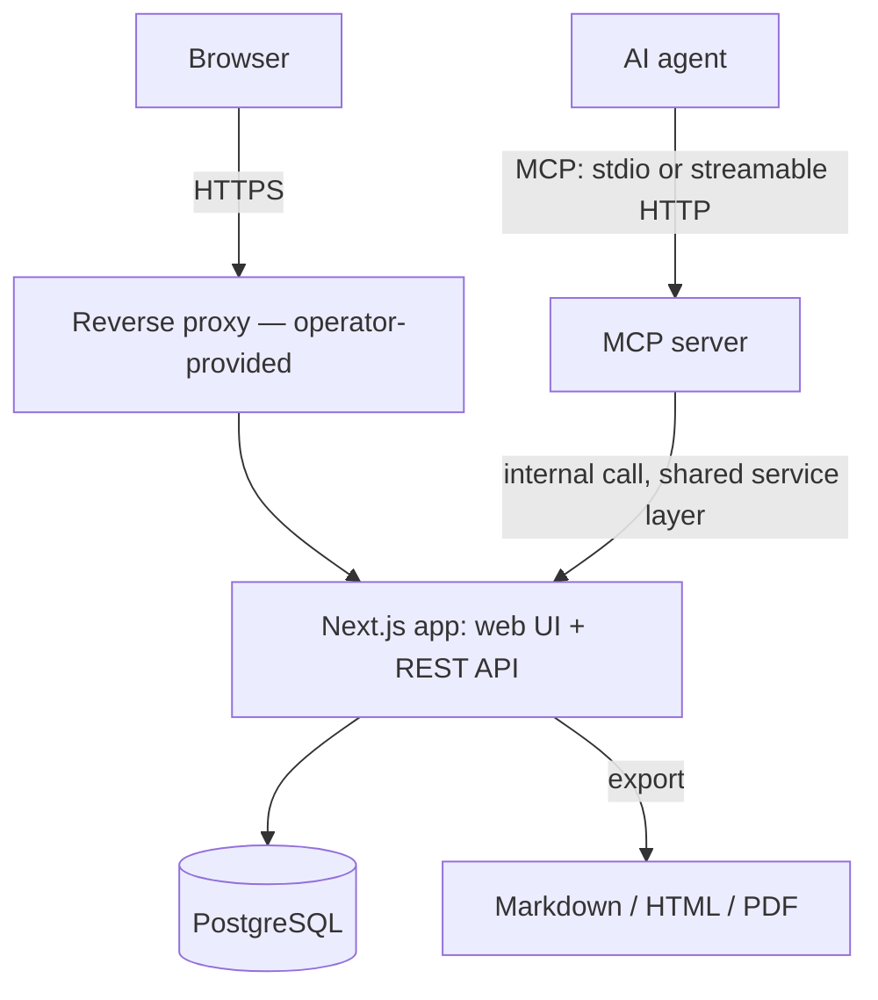
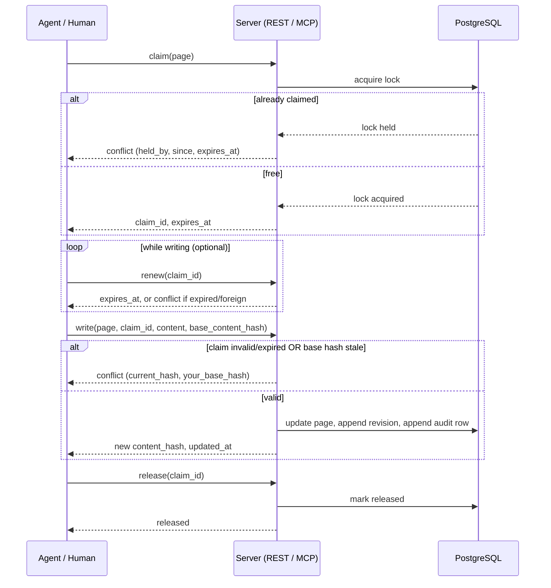

# Architecture

## Components

Web UI and the MCP server are both thin clients of one REST/service layer
running inside the same Next.js process. There is no separate backend
service and no message queue — claims and writes go through the same code
path regardless of whether the caller is a browser client or an agent
token, so the conflict-safe write guarantee applies uniformly to both.



clewwiki is a server product, not an offline-first client: agents and
browsers always talk to a live instance, and there is no local cache or
sync/reconciliation layer to design for.

## Claim → write → release

The conflict-safe write protocol is the core mechanism the rest of the
product is built around. A claim is a time-boxed lease on a page, or on a
named section within a page, implemented as a database-level lock rather
than an application-level heuristic.



Unrenewed claims expire on the server: lazily, on the next claim attempt
against the same target, and via a periodic sweep. Granularity defaults to
the whole page; a caller may instead claim a named section, so one writer
can hold a section while another edits a different section of the same
page concurrently.

## Anchor model

An anchor ties a page section to a declaration in a source repository:

```
{ page_id, section_id, kind, qualified_name, file_hint, token_hash,
  line_range?, state, last_checked_at }
```

Design decisions, validated on a real refactoring history (26 commits,
479 anchors; symbol anchors produced 0 false positives where naive
line-range anchors produced ~50%):

- **Identity is the declaration, not the location.** An anchor is
  `{kind, qualified_name}`; `file_hint` speeds up resolution but a
  declaration moved to another file is still found by a repository-wide
  search for the same identity.
- **The hash covers the AST token sequence, not text.** Normalising
  whitespace and comments is not enough: a formatter run flips more than
  half of text-based hashes while changing nothing semantically. Hashing
  the parser's token stream keeps formatting-only commits quiet.
- **Three resolution states instead of one flag.** `stale` (same
  declaration, body changed), `moved-renamed` (declaration recovered
  under a new name or container via body match), `lost` (nothing
  resolvable). Each state is shown to the reader differently; nothing is
  rewritten automatically — a human or agent reviews and clears it.
- **Line ranges are a fallback only.** Blocks with no resolvable
  declaration (configuration, prose) keep a `line_range` plus hash; the
  share of line-range anchors per repository is logged as an early signal
  of eroding trust.
- **Parsers via tree-sitter.** Swift first, then TypeScript and Kotlin;
  adding a language means adding its declaration node-type table.

The same staleness mechanism drives the linked technical/human document
pair: instead of targeting a code hash, it targets the paired document's
content hash, so editing one side of the pair flags the other as
potentially out of sync.

## Data model

The schema is organized around these entities (full column-level detail
lives in the implementation, not here):

- `workspaces`
- `users`
- `agent_tokens`
- `pages`
- `page_revisions`
- `claims`
- `agent_notes`
- `anchors`
- `page_links`
- `agent_write_audit`

`page_revisions` is an append-only version history; ephemeral agent notes
are explicitly excluded from it and expire with the claim they are bound
to. `agent_write_audit` is written in the same transaction as the write
attempt it records, including failed and conflicting attempts, so it
serves as a forensic log rather than best-effort telemetry.
