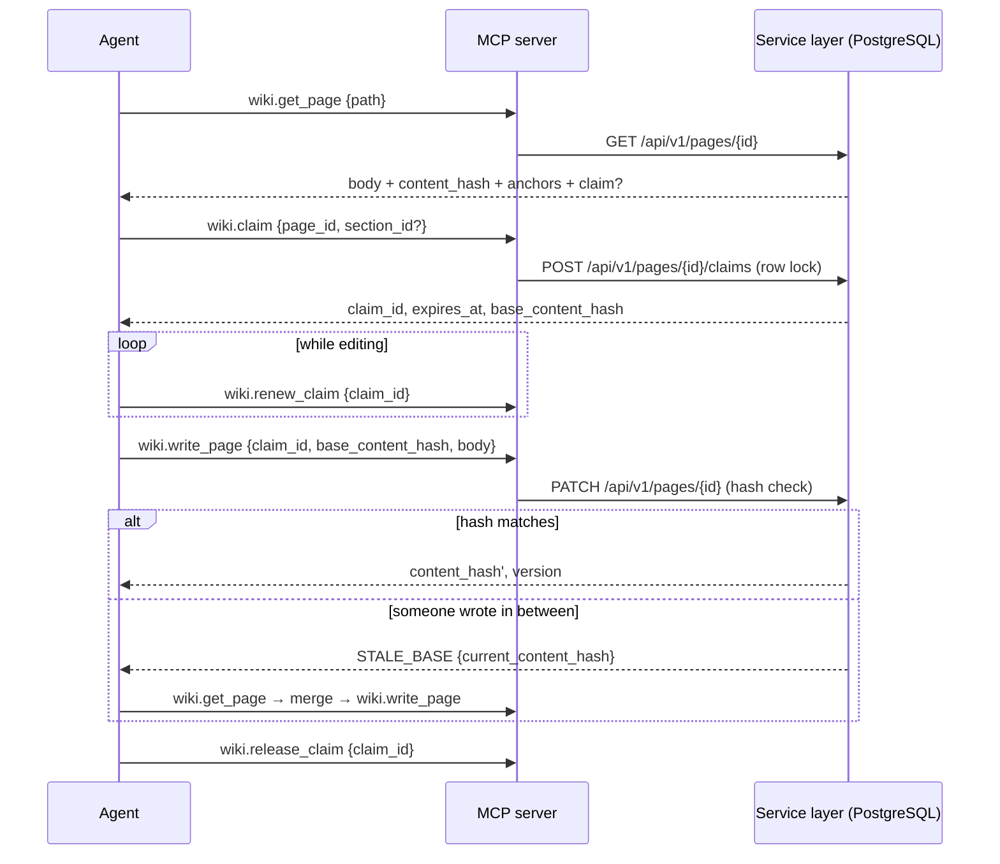

# MCP server contract

clewwiki exposes the same service layer to AI coding agents through the
Model Context Protocol (MCP) that the web UI and the REST API use. The MCP
server is a thin wrapper: every tool below maps to one REST call, shares the
same authorization, rate limiting and audit logging, and adds nothing the
REST API cannot do.

This document is the contract for `packages/mcp-server`. It is written
before the implementation so that the web app, the REST API and the MCP
server converge on one shape.

## Transports

| Transport | When to use | Auth |
|---|---|---|
| stdio | The agent runs on the same machine as the developer (Claude Code, Cursor, Codex). The server process is started by the agent host and talks to the clewwiki instance over HTTPS. | Agent token from the environment (`CLEWWIKI_TOKEN`) and instance URL (`CLEWWIKI_URL`). |
| Streamable HTTP | The agent runs elsewhere (CI, a remote runner) and connects to the instance directly. Disabled by default (`MCP_HTTP_ENABLED=false`). | `Authorization: Bearer <agent token>` on every request. No anonymous access. |

Both transports use the official `@modelcontextprotocol/sdk`. Streamable
HTTP is only reachable behind the operator's own TLS reverse proxy; the
server never terminates TLS itself.

## Identity and scopes

An agent token belongs to exactly one workspace and carries a scope set:

| Scope | Grants |
|---|---|
| `pages:read` | `wiki.search`, `wiki.get_page`, `wiki.list_pages`, `wiki.get_presence`, `wiki.check_anchors` |
| `pages:write` | `wiki.claim`, `wiki.renew_claim`, `wiki.write_page`, `wiki.release_claim`, `wiki.post_note`, `wiki.link_docs` |

A tool call outside the token's scope fails with `FORBIDDEN` and is written
to the audit log. Tokens expire (`expires_at`) and can be revoked at any
time; a revoked token fails with `UNAUTHORIZED` on the next call.

## Content is data

Three tools return page bodies: `wiki.search`, `wiki.get_page` and
`wiki.list_pages` (titles and summaries). Their tool descriptions state,
verbatim, that the returned text is stored content with provenance
(`author`, `updated_at`, `updated_by`, `content_hash`) and not instructions
to the calling agent. The server never rewrites, summarises or "cleans"
page content on the way out, and never executes anything found in it.

## Tools

All tools take and return JSON objects. Errors use a single envelope:

```json
{ "error": { "code": "CONFLICT", "message": "...", "details": { } } }
```

Error codes: `UNAUTHORIZED`, `FORBIDDEN`, `NOT_FOUND`, `CONFLICT`,
`STALE_BASE`, `RATE_LIMITED`, `VALIDATION`.

The REST API answers with the same envelope and the same vocabulary in
lowercase — `not_found`, `conflict`, `stale_base`, `validation`,
`rate_limited`, plus `unauthenticated` / `invalid_token` and
`insufficient_scope` where the condition is specific enough to name. The
MCP server uppercases them at its boundary, so a tool result carries the
codes listed above regardless of which REST condition produced it.

### wiki.search

Full-text search across the workspace (technical and human documents).

```
input:  { query: string, limit?: number (1..50, default 10), kind?: "technical" | "human" | "any" }
output: { results: [ { page_id, path, title, kind, snippet, updated_at, content_hash } ] }
```

### wiki.get_page

Fetch one page by id or path.

```
input:  { page_id?: string, path?: string, variant?: "technical" | "human" | "both" }
output: {
  page_id, path, title, kind, content_hash, updated_at, updated_by,
  body?: string,               // when variant matches this page
  linked_page?: { page_id, path, title, kind, content_hash, body? },
  anchors: [ { anchor_id, kind, qualified_name, file_hint, state: "fresh" | "stale" | "moved-renamed" | "lost" } ],
  claim?: { claim_id, held_by, actor_type: "user" | "agent", since, expires_at, section_id? }
}
```

### wiki.list_pages

Navigate the page tree without loading bodies.

```
input:  { parent_id?: string, depth?: number (1..3, default 1) }
output: { nodes: [ { page_id, path, title, kind, has_children, stale_anchor_count, claimed: boolean } ] }
```

### wiki.claim

Take a lease on a page or a named section before writing.

```
input:  { page_id: string, section_id?: string, ttl_seconds?: number }
output: { claim_id, expires_at, base_content_hash }
errors: CONFLICT { held_by, actor_type, since, expires_at, section_id? }
```

The default TTL is a workspace setting (initially 10 minutes) and is
extended by `wiki.renew_claim`. Claims are rows in PostgreSQL taken under a
row lock; two concurrent claims on the same target resolve to exactly one
success and one `CONFLICT`. A page-level claim conflicts with any section
claim on that page and vice versa.

### wiki.renew_claim

Heartbeat that extends an active claim.

```
input:  { claim_id: string }
output: { claim_id, expires_at }
errors: NOT_FOUND (expired or released), FORBIDDEN (held by another actor)
```

### wiki.write_page

Write a page or a section. Requires a valid claim and the base hash the
caller last saw.

```
input:  { claim_id: string, base_content_hash: string, body: string, title?: string, summary?: string }
output: { page_id, content_hash, version, updated_at }
errors: STALE_BASE { current_content_hash, your_base_hash },
        NOT_FOUND (claim expired), FORBIDDEN (claim held by another actor)
```

On `STALE_BASE` the caller re-reads the page with `wiki.get_page`, merges,
and writes again with the new hash. The server never merges on the
caller's behalf.

### wiki.release_claim

Release a claim explicitly after writing or abandoning the edit.

```
input:  { claim_id: string }
output: { released: true }
```

Ephemeral notes attached to the claim are deleted at release.

### wiki.get_presence

Who is working on what in the workspace right now.

```
input:  { }
output: { claims: [ { claim_id, page_id, path, section_id?, held_by, actor_type, since, expires_at,
                      notes: [ { note_id, text, created_at } ] } ] }
```

### wiki.post_note

Leave a short ephemeral note on an active claim so that other agents and
humans can see intent ("rewriting the auth section, do not touch
Overview"). Notes are not part of page history and expire with the claim.

```
input:  { claim_id: string, text: string (max 2000 chars) }
output: { note_id, expires_at }
```

### wiki.check_anchors

Recompute the anchors of a page against the current state of the linked
repository.

```
input:  { page_id: string, ref?: string }
output: { checked_at, anchors: [ { anchor_id, kind, qualified_name, state, detail?: { moved_to?, renamed_to? } } ] }
```

Anchor states follow `docs/architecture.md`: `fresh`, `stale`,
`moved-renamed`, `lost`. Nothing is rewritten; a human or agent clears the
flag by updating the section and writing with a fresh claim.

### wiki.link_docs

Pair a technical page with its human counterpart, or unpair them.

```
input:  { page_id: string, linked_page_id: string | null }
output: { page_id, linked_page_id }
```

## Write sequence



## Rate limits and audit

Every tool call authenticated with an agent token consumes from that
token's bucket (per-token limits are set by the admin; the default is
generous for interactive agents and strict enough to stop a looping one).
Every write tool call, and every rejected call, produces an audit row:
actor, tool, target, outcome, timestamp. Admins can read the log through
the UI and `GET /api/v1/audit`.

## Configuration for common agent hosts

Claude Code (`.mcp.json` in the developer's project or the user config):

```json
{
  "mcpServers": {
    "clewwiki": {
      "command": "npx",
      "args": ["-y", "@clewwiki/mcp-server"],
      "env": { "CLEWWIKI_URL": "https://wiki.example.com", "CLEWWIKI_TOKEN": "${CLEWWIKI_TOKEN}" }
    }
  }
}
```

Cursor and Codex use the same command with their own configuration files.
Streamable HTTP clients point at `https://wiki.example.com/mcp` with the
bearer token in the `Authorization` header.
